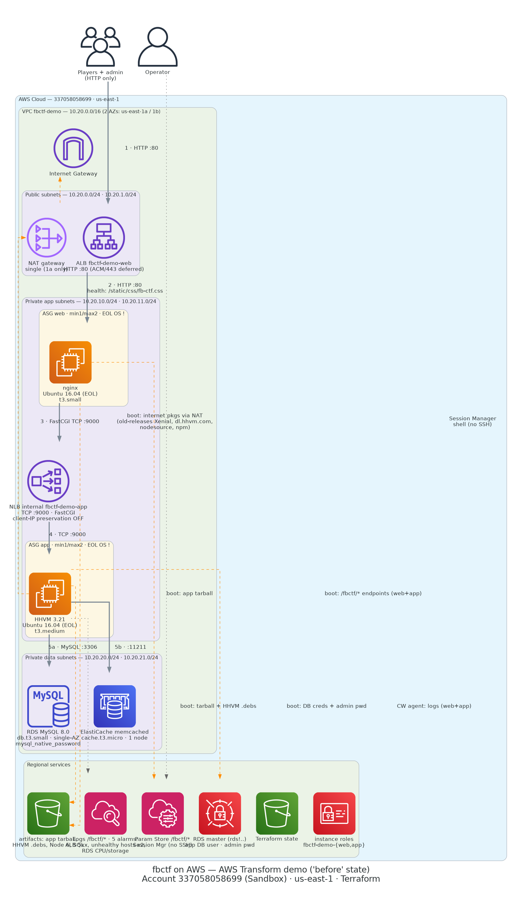

# aws-transform-demo-kit

An **AWS Transform demo kit** for the **legacy "before" state** — the estate
Transform migrates. The modernized target (Fargate, Aurora) is Transform's
output, not this repo's.

| Part | What it is | Deployed? | Cost |
|---|---|---|---|
| **The assessment inventory** (`inventory/`) | A server portfolio as data → `generate.py` → one assessment ZIP | No — data | `$0` |
| **The modernization fixtures** (`modernization/`) | Real .NET Framework, Java 8, COBOL and T-SQL code for Transform's transformation agents | No — source only | `$0` |
| **The SQL Server estate** (`environments/sqlmod`) | One EC2 SQL Server 2022 + two live apps against it — **Contoso Scoreboard** (.NET Framework 4.8 / IIS) and **Project Nami** (WordPress-on-SQL-Server / PHP) — in a 2-AZ VPC | On demand | ~$0.20/hr up, `$0` destroyed |
| **The Oracle estate** (`environments/oramod`) | One EC2 Oracle 21c XE + **Contoso Catalog** (Java 8 / Spring Boot 2.7) against it, in a 2-AZ VPC | On demand | ~$0.15/hr up, `$0` destroyed |
| **The discovery collector** (`environments/discovery-collector`) | The real AWS Transform discovery tool + a synthetic Linux fleet + a Windows/SQL Express box; peers into the sqlmod and oramod VPCs. Its last export is committed at `inventory/discovery-tool-export/` | On demand | ~$0.30/hr up, self-terminating |

Feature-by-feature coverage: [`docs/transform-feature-coverage.md`](docs/transform-feature-coverage.md).
End-to-end run order: [`docs/demo-runbook.md`](docs/demo-runbook.md).
Scope decisions: [ADR 004](docs/decisions/004-demo-scope-expansion.md), [ADR 005](docs/decisions/005-drop-the-estate.md), [ADR 006](docs/decisions/006-retire-fbctf.md).

Decisions are recorded in [`docs/decisions/`](docs/decisions/); the S3 artifact inventory in [`docs/artifacts-manifest.md`](docs/artifacts-manifest.md).

---

## The retired fbctf live app

> **Retired 2026-09-01 ([ADR 006](docs/decisions/006-retire-fbctf.md)).** `environments/demo`
> and its state are gone; `fbctf-aws-requirements.md` and the sections below are
> history. fbctf had no Transform code path and was MySQL-locked — the
> `environments/sqlmod` estate replaced it as the live app.

### Architecture



<details>
<summary>Text summary</summary>

```
Internet → ALB (HTTP:80, public subnets)
  → nginx ASG (private-app subnets)
    → internal NLB (TCP:9000, FastCGI)
      → HHVM ASG (private-app subnets)
        → RDS MySQL 8.0 + ElastiCache memcached (private-data subnets)
```

</details>

- Account `337058058699` (Sandbox, `cloudcrafters-sandbox` profile with the `AWSTransformAccess` permission set), region `us-east-1` — colocated with the AWS Transform workspace.
- All resource names carry the `fbctf-` prefix — the deploy permission set scopes IAM, S3, and Secrets Manager writes to `fbctf-*`.
- No SSH — instance access via SSM Session Manager only.
- Boot-time provisioning from a pinned, pre-patched app tarball in S3 (ADR 001). Four upstream breakages are patched in the tarball (`scripts/make-source-tarball.sh`).

### Layout

Independent roots, each with its own state key in bucket `fbctf-demo-tfstate-337058058699-use1` (native S3 locking, no DynamoDB):

| Root | State key | Contents |
|---|---|---|
| `environments/demo` | `fbctf-demo/terraform.tfstate` | **Retired** — the root is deleted and the state key is empty |
| `environments/artifacts` | `fbctf-artifacts/terraform.tfstate` | The artifacts bucket only — **survives destroy cycles** (it held the insurance against dead upstream repos) |

### Runbook

```sh
make init
make plan
make apply      # ~12 min of applies; app tier healthy ≈4 min later, web ≈5 min after that
make destroy    # ALWAYS after a demo session — the app runs an EOL OS
```

- **Demo URL**: `alb_dns_name` output. Expect the Facebook CTF login page over plain HTTP.
- **Admin login**: user `admin`; password:
  `aws secretsmanager get-secret-value --secret-id fbctf-demo/admin-password --profile cloudcrafters-sandbox --query SecretString`
- **Shell access**: `aws ssm start-session --target <instance-id> --profile cloudcrafters-sandbox`
- **Boot debugging**: `/var/log/user-data.log` on the instance, also shipped to the `/fbctf/user-data` CloudWatch log group. HHVM errors → `/fbctf/hhvm`; nginx → `/fbctf/nginx`.
- **Alarms** (no actions wired — console-visible only): ALB 5xx, unhealthy hosts on both target groups, RDS CPU/storage.
- **Full rebuild of artifacts** (only needed if the pinned commit or patches change): `scripts/make-source-tarball.sh`, then launch a builder with `scripts/builder-userdata.sh` (see script headers).

### Boot sequence after `make apply`

1. RDS + ElastiCache come up during the apply itself (~7 min).
2. App instance boots: prebuilt tarball → `provision.sh` (hhvm) → settings.ini → guarded DB bootstrap (schema + app user + admin row, one-shot) → HHVM on :9000 → NLB healthy (~4 min).
3. Web instance boots: prebuilt tarball → `provision.sh` (nginx: Node 6, npm, grunt) → HTTP-only site config pointing FastCGI at the NLB → ALB healthy (~5 min).
4. Scoreboard serves at the ALB DNS.

### ⚠️ Destroy discipline

The instances run Ubuntu 16.04 (EOL, unpatched) by design — that's the point of the demo. Do not leave this running unattended. `make destroy` after every session (~$5/day if left up). The artifacts root is not touched by destroy; re-apply brings the scoreboard back in ~20 minutes with the same admin password reachable via Secrets Manager.

---

## The assessment inventory

`inventory/` is a 14-server portfolio — Windows/.NET, SQL Server, Java, COBOL,
self-managed services, an idle box — expressed as YAML and turned into one
assessment ZIP. It costs nothing and is never deployed.

```sh
python3 -m pip install -r inventory/requirements.txt
python3 inventory/generate.py          # -> inventory/out/fbctf-assessment.zip
```

Details, and what each server is there to trigger: [`inventory/README.md`](inventory/README.md).

---

## The modernization fixtures

`modernization/` holds real code for Transform's transformation agents — one
fixture per capability:

| Fixture | Capability |
|---|---|
| [`dotnet-scoreboard/`](modernization/dotnet-scoreboard) | .NET Framework 4.8 → cross-platform .NET |
| [`java-catalog/`](modernization/java-catalog) | Java 8 → 17 |
| [`cobol-rollup/`](modernization/cobol-rollup) | COBOL / mainframe |
| [`sqlserver-schema/`](modernization/sqlserver-schema) | SQL Server → Aurora schema conversion |
| [`atx-task.md`](modernization/atx-task.md) | Transform Custom (`atx`) — generate the target Terraform |

Source only — nothing here is deployed. See [`modernization/README.md`](modernization/README.md).

---

## The live estate

Three real applications on two database engines, in two on-demand roots. State
keys `fbctf-sqlmod/` and `fbctf-oramod/` in the same bucket as above.

| Root | Database | Apps | Transform jobs it feeds |
|---|---|---|---|
| [`environments/sqlmod`](environments/sqlmod) | SQL Server 2022 (EC2, `mssql/server:2022` container) | **Contoso Scoreboard** — ASP.NET Web Forms / .NET Framework 4.8 / IIS ([source](environments/sqlmod/app)); **Project Nami** — WordPress on SQL Server / PHP | .NET → .NET 8; SQL Server → Aurora (full agentic); the "no PHP code path" close |
| [`environments/oramod`](environments/oramod) | Oracle 21c XE (EC2, `gvenzl/oracle-xe` container) | **Contoso Catalog** — Java 8 / Spring Boot 2.7 ([source](environments/oramod/app)) | Java 8 → 17 (`atx`); Oracle → Aurora PostgreSQL |

```sh
cp environments/sqlmod/terraform.tfvars.example environments/sqlmod/terraform.tfvars   # set transform_ro_password
make apply   ENV=sqlmod
make apply   ENV=oramod
make destroy ENV=sqlmod && make destroy ENV=oramod   # after the demo
```

Both app tiers are reachable on `:80` from `app_allow_cidr` / `wordpress_allow_cidr`
(default `0.0.0.0/0` — tighten to your IP for a public demo). Database ports are
VPC-internal; SSH / WinRM / Oracle Net open only to the discovery-collector CIDR.

---

## The discovery collector

`environments/discovery-collector/` runs the **actual AWS Transform discovery
tool** on an EC2 host, peers into the two estates above, and SSH/WinRM-collects
12 hosts (6 synthetic Linux roles, a Windows + SQL Express box, and the 5 live
sqlmod/oramod hosts) into `discovery_tool_export.zip`. The last export is
committed at [`inventory/discovery-tool-export/`](inventory/discovery-tool-export),
so the assessment can ingest genuine discovery data at `$0` without re-running it.

```sh
cp environments/discovery-collector/terraform.tfvars.example environments/discovery-collector/terraform.tfvars
make apply   ENV=discovery-collector
terraform -chdir=environments/discovery-collector output next_steps
make destroy ENV=discovery-collector
```

See [`environments/discovery-collector/README.md`](environments/discovery-collector/README.md).
